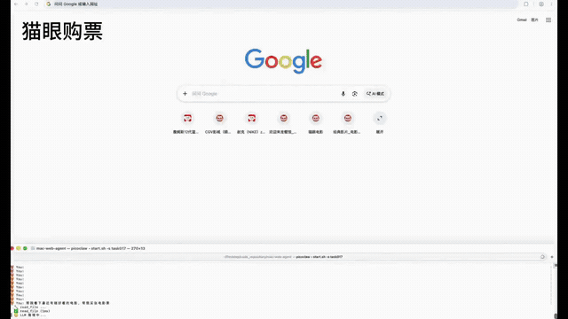

# Claw Agent

[中文说明](README.zh.md)

**Claw Agent** is a real-world-centric **local, natural-language browser agent**: you describe a goal in one sentence, and it works inside a real Chrome browser to observe the page, call tools, verify results, and correct itself — step by step — until a multi-step web task is done. It can also be extended to edge scenarios such as smart-cockpit head units.

> **Make AI not just talk, but get things done.**

Over the last two years we have seen plenty of AI that can write poems and paint pictures. But the moment you actually ask it to book a movie ticket, compare prices, or plan a trip for you, it just says: "Sorry, I can't do that — but let me tell you about it instead…"

**That is a brain with no hands.** Claw Agent exists to fix exactly this: to give a large language model a pair of hands that can operate the real world. It is not a fixed script or a click recorder; it is an executor that "looks at the screen and figures things out on its own."

Under the hood it combines a lightweight **Agent Runtime**, declarative task **Skills**, an **MCP browser server**, and the **Chrome DevTools Protocol (CDP)** to complete multi-step web tasks efficiently in a real browser. The one-command scripts currently target macOS and Android head units, while the core Agent Runtime and Browser MCP are built on cross-platform Go and CDP and can be ported to other desktop systems.

### Why it matters: from "people looking for apps" to "services finding people"

A quiet revolution is underway in the smart-cockpit industry — apps are dying, and services are becoming eternal. When a car's screen is still cluttered with dozens of app icons, a driver at 120 km/h simply has no time to "open the app drawer, swipe to find an icon, and wait for a cold start." The real direction is **de-app-ification, service atomization, and Zero-Layer interaction**: the user says "I'm hungry," and the system searches, filters, decides, and executes in the background — instead of dumping a list of options on the driver.

The bridge between user intent and service execution is exactly the **Agent**. Claw Agent's capability model — perceive (observe the page), plan (decompose the task), and act (call tools) — maps directly onto what a system-level cockpit agent needs.

> **macOS & in-car demo validated:** We have completed end-to-end demo-level validation of Claw Agent on both macOS (Chrome) and a real in-vehicle environment, driving the browser with natural language to complete multi-step web task chains. This is an internal, demo-level validation rather than a production solution, but it proves that this architecture can be ported directly to resource-constrained, "invisible-interaction" edge scenarios like the smart cockpit.

It is designed for workflows such as web search, media playback, shopping assistance, ticket selection, travel lookup, and general website interaction, and can be extended to edge scenarios such as smart-cockpit head units.

> Claw Agent is not tied to a single environment: it runs locally on macOS + Google Chrome via the one-command scripts, and the core Agent Runtime (cross-platform Go) can also run in Docker/containers (with your own model and dependency configuration). It has been validated end-to-end at demo level in three environments — macOS (Chrome), in-car WebView, and in-car native Android apps. When an operation requires account permissions, security verification, sensitive credentials, or may produce an irreversible result, the agent pauses and waits for user authorization or manual completion before continuing.

## Highlights

- 🗣️ **Natural language as action** — turns a one-sentence request into an iterative observe, act, and verify loop instead of replaying a fixed macro.
- 🌐 **Real Chrome automation** — controls a visible Chrome instance over the Chrome DevTools Protocol (CDP), working on real pages.
- 🧰 **MCP browser toolset** — exposes 33 tools for navigation, semantic DOM snapshots, input, scrolling, screenshots, JavaScript, iframe execution, media control, and website-specific operations.
- 📜 **Declarative skills** — task playbooks live in `SKILL.md`; the repository includes JD shopping, Taobao shopping, Maoyan movie booking, and a generic web fallback.
- 🧭 **Platform routing** — a Markdown registry describes 25 platform entries, capability tags, desktop URLs, selectors, loading hints, and fallback chains.
- ⚙️ **Full agent runtime** — supports tool calling, session persistence, context compaction, model fallback, steering, hooks, and sub-agents, with room to add more message channels.
- 🔌 **Multiple model backends** — works out of the box with OpenAI-compatible endpoints and local Ollama, and can be extended to other providers.
- ⚡ **Lightweight & fast** — Go runtime with `< 1s` warm startup, `~0.5%` average CPU during tasks, and `~38 MB` memory, a natural fit for resource-constrained edge scenarios.
- 🛡️ **Human-in-the-loop boundaries** — workflows stop for login challenges, sensitive data, order confirmation, and final payment.
- ✅ **macOS & in-car scenarios validated** — end-to-end demo-level validation completed on both macOS (Chrome) and a real in-vehicle environment, driving the browser with natural language through multi-step task chains.

## 📰 News

- ✅ **macOS & in-car demo working** — completed a demo-level validation on both macOS (Chrome) and a real in-vehicle environment, driving the browser with natural language through multi-step web task chains. This is an internal, demo-level validation rather than a production solution, but it proves the architecture can be ported to resource-constrained, "invisible-interaction" edge scenarios such as the smart cockpit.
- ⚡ **Lightweight performance baseline** — in reference benchmarks the Agent Runtime shows a "fast startup, low CPU, small memory" profile; see the performance section below.

## 📑 Table of Contents

- [Highlights](#highlights)
- [🎥 Demos](#-demos)
- [Lightweight performance](#lightweight-performance)
- [Architecture](#architecture)
- [How a request is executed](#how-a-request-is-executed)
- [Quick start](#quick-start)
- [Android (in-vehicle) setup](#android-in-vehicle-setup)
- [Configuration](#configuration)
- [Extending the project](#extending-the-project)
- [Security and operational boundaries](#security-and-operational-boundaries)
- [Acknowledgements](#acknowledgements)
- [📄 License](#-license)

## 🎥 Demos

The recording below runs ten everyday tasks end-to-end on the real system in a single take: **Maoyan movie booking, GitHub info aggregation, JD shopping, video playback, Apple Music search, Weibo hot-search aggregation, and more** — all driven by natural language, pausing at the confirmation step whenever an irreversible action such as payment is involved.



▶️ The GIF above is a sped-up preview (~22s loop). Full HD recording: [assets/demo.mp4](assets/demo.mp4) (~15 minutes; click to download and play locally).

### Demo 1 · Maoyan movie booking (pick movie -> pick cinema/showtime -> seat selection → payment cashier)

**User instruction:** Show me some well-reviewed recent movies and book me a ticket.

The agent finds now-showing movies, enters Maoyan to select seats and place the order, and stops at the Meituan/WeChat cashier (order number and amount already generated), leaving the final payment to the user.

### Demo 2 · GitHub info aggregation

**User instruction:** Find high-star repositories about Agent applications on GitHub and summarize their core capabilities.

The agent searches and opens the relevant project pages, aggregates information across multiple repositories through page understanding and interaction, and presents the key findings to the user.

### Demo 3 · iQiyi TV show playback (search -> pick episode -> play -> verify playback status)

**User instruction:** Play the first episode of "Kuangbiao" (《狂飙》) on iQiyi.

The agent enters iQiyi to search, click, and understand the page, then completes video playback.

### Demo 4 · JD shopping (search product -> select size → payment cashier)

**User instruction:** Buy me a pair of LeBron 12 basketball shoes in size 43 on JD.

The agent searches and opens the product page, selects size 43, proceeds to checkout and the cashier, and stops at the "payment verification / enter payment password" step, waiting for the user to complete payment.

### Demo 5 · Apple Music song search (search -> page understanding → click play)

**User instruction:** Play "Farewell Kiss" (《吻别》) by Jacky Cheung on Apple Music.

The agent performs a keyword search, extracts the page information, selects the target song, and plays it.

### Demo 6 · YouTube video playback (search -> pick video -> play -> verify playback status)

**User instruction:** Play some cute cat videos on YouTube for me.

The agent enters YouTube to search, recognizes the page, and successfully auto-plays the relevant content.

### Demo 7 · Bilibili video playback (search -> pick video -> play -> verify playback status)

**User instruction:** Play Luo Xiang's latest criminal law lecture video on Bilibili.

The agent enters Bilibili to search, recognizes the page, and successfully auto-plays the content.

### Demo 8 · Flight lookup (open Ctrip -> page recognition/interaction -> extract info)

**User instruction:** Find flights from Beijing to Shanghai for tomorrow.

The agent opens Ctrip for page recognition and interaction, returning detailed trip, date, and price information.

### Demo 9 · Baidu weather query (open Baidu -> keyword search -> extract info)

**User instruction:** Look up tomorrow's weather in Beijing via Baidu.

The agent opens Baidu, enters a keyword search, extracts and understands the page information, and summarizes the weather.

### Demo 10 · Weibo hot-search aggregation

**User instruction:** Show me today's Weibo hot-search topics.

The agent opens the Weibo hot-search page and extracts the ranked list, returning the organized results.

## Lightweight performance

Claw Agent uses a lightweight Go runtime and demonstrates excellent resource efficiency in the reference benchmark:

| Metric | reference result |
|---|---:|
| Startup time (warm run) | `< 1 second` |
| Average CPU during task (weather-query) | `about 0.5%` |
| Memory usage | `about 38 MB` |

Actual results vary with hardware, model service, task complexity, browser pages, and measurement methodology. These figures describe the Agent Runtime itself and exclude Chrome and external model-service resource usage.

A "fast startup, low CPU, small memory footprint" profile is exactly what resource-constrained edge scenarios such as the smart cockpit value most — the Agent Runtime itself consumes almost nothing, leaving the precious compute budget for the business and the model.

## Architecture

The diagram below shows the **macOS** execution path. The in-vehicle profile is symmetric: the same Claw Agent runtime makes decisions, while the execution layer swaps `browser-mcp` for `android-mcp` (WebView CDP + accessibility) — see "Android (in-vehicle) setup".

```text
User / CLI / message channel
              |
              v
+-------------------------------------------+
| Claw Agent runtime                       |
| routing, prompt, session, ReAct, provider |
+---------------------+---------------------+
                      | MCP (Streamable HTTP / JSON-RPC)
                      v
+-------------------------------------------+
| browser-mcp                               |
| browser primitives and semantic helpers  |
+---------------------+---------------------+
                      | Chrome DevTools Protocol
                      v
+-------------------------------------------+
| Google Chrome                             |
| rendered pages, DOM, runtime, input       |
+-------------------------------------------+
```

The repository has two independent Go modules plus one in-vehicle Android (Kotlin) module:

| Module | Location | Responsibility |
|---|---|---|
| `claw-agent` | repository root (`browser-mcp/`) | macOS execution layer: Browser MCP server and Chrome/CDP integration |
| `github.com/sipeed/picoclaw` | `picoclaw/` | Decision layer: agent runtime, providers, sessions, tools, MCP client, gateway, and channels (shared by macOS and in-vehicle) |
| `com.clawagent` (Kotlin/Gradle) | `android/` | In-vehicle execution layer: `android-mcp` (WebView CDP + native-app accessibility) |

All three are coupled at runtime through MCP, not through imports.

## How a request is executed

```text
request
  -> select agent and session
  -> assemble prompt, history, summary, and active skills
  -> call the configured LLM
  -> normalize tool calls
  -> execute a local or MCP tool
  -> send the tool result back to the LLM
  -> repeat until the task is complete
  -> persist the session and return the final response
```

For browser work (macOS), the tool path continues through `browser-mcp` and CDP:

```text
Agent ToolRegistry
  -> MCP client
  -> POST /mcp
  -> browser-mcp
  -> CDP WebSocket
  -> Chrome
```

In-vehicle browser / native-app tasks share the same `Agent ToolRegistry -> MCP client -> POST /mcp` front half, then switch to `android-mcp` (WebView over CDP, native apps over accessibility).

## Browser tools (macOS)

The macOS browser execution layer — `browser-mcp` — exposes 33 tools in four groups. (For the in-vehicle `android-mcp` tools, see "Android (in-vehicle) setup".)

### Browser primitives

- Page discovery, reuse, creation, and navigation
- Semantic DOM snapshots with stable element references
- Screenshot capture
- Click, DOM click, type, fill, hover, drag, and scroll
- JavaScript execution in the main page or an iframe

### Cross-site semantic helpers

- Search-result link extraction
- Rendered page-text extraction
- Element waiting and overlay dismissal
- Media detection, play, and pause
- Login-wall detection
- Play-button discovery

### JD helpers

- Extract available sizes
- Select and verify a size
- Detect checkout and payment controls across different page layouts

### Maoyan helpers

- Extract cinemas and showtimes
- Open a show
- Query and select seats
- Dismiss booking-page modals

Complex, repeatable DOM decisions are implemented in Go helpers so the model can call one stable tool instead of generating long, fragile scripts for every attempt.

## Skills and platform routing

The project separates task strategy from browser execution:

- `skills/*/SKILL.md` defines when a workflow applies, how it should proceed, and where user confirmation is mandatory.
- `skills/fallback-webview/platforms.md` registers platform capabilities, desktop URLs, selectors, loading behavior, and fallback order.
- `browser-mcp/` provides the actions those workflows can invoke.

Included skills:

| Skill | Purpose |
|---|---|
| `jd-shopping` | Default assisted shopping workflow for JD |
| `taobao-shopping` | Taobao workflow when the user explicitly selects Taobao |
| `maoyan-movie` | Movie, cinema, showtime, seat, and order-confirmation workflow |
| `fallback-webview` | Generic search, media, travel, food, information, and website interaction |

The in-vehicle agent has **pre-routing skills** (`car-skills/`, not synced to mac by `setup.sh`) whose sole purpose is to deterministically dispatch an in-vehicle query to either the in-vehicle browser or a native in-vehicle app before execution — they carry no business logic, which is decided at runtime by the ReAct loop after routing.

| Skill | Purpose |
|---|---|
| `fallback-webview` | Default fallback: any query that does not name a native app (check weather / search / browse) → in-vehicle WebView CDP |
| `car-native` | Query containing "use XX app / open XX app" → in-vehicle accessibility native app |

Adding a conventional website usually requires a new platform registry entry. Complex checkout, canvas, iframe, or highly dynamic workflows may also require a dedicated skill or Go helper.

## Requirements

The top-level scripts currently target macOS.

- macOS on Intel or Apple Silicon
- Homebrew
- Go 1.25 or newer (the build auto-downloads the exact toolchain)
- Google Chrome installed at `/Applications/Google Chrome.app`
- Python 3 when `envsubst` is unavailable
- An LLM API key, or a running local Ollama instance

## Quick start

### 1. Clone and build

```bash
git clone <repository-url> claw-agent
chmod +x ./scripts/*.sh
cd claw-agent
./scripts/setup.sh
```

The setup script builds both Go binaries, copies `.env.example` to `.env` when needed, synchronizes skills and workspace rules, and renders the agent configuration under `~/.picoclaw/`.

### 2. Configure a model

Edit `.env`:

```dotenv
LLM_API_KEY=your-api-key
LLM_API_BASE=https://api.openai.com/v1
LLM_MODEL_ID=your-model-id
PICOCRAW_MODEL_NAME=default
LLM_THINKING_LEVEL=off
```

For Ollama:

```dotenv
LLM_API_KEY=
LLM_MODEL_ID=qwen3:32b
PICOCRAW_MODEL_NAME=ollama-local
```

Make sure Ollama is running and the model has already been pulled.

### 3. Run

One-shot request:

```bash
./scripts/start.sh "Search for tomorrow's weather in Beijing"
```

Interactive REPL:

```bash
./scripts/start.sh
```

Debug output and an isolated named session:

```bash
./scripts/start.sh -d -s research "Compare three travel options"
```

`start.sh` synchronizes the latest skills, renders configuration, starts or reuses Chrome and `browser-mcp`, and then launches Claw Agent.

> **Browser vs built-in search for information tasks**: the macOS config keeps the built-in `web_search`/`web_fetch` enabled, so pure information tasks ("check weather / search GitHub / hot topics") may be satisfied by built-in search/fetch (faster) instead of driving real Chrome. To route such tasks through the real browser, add a hint like **"用浏览器 / open in browser / use the browser"** to the query; to force it (like the in-vehicle config does), set `tools.web.enabled` and `tools.web_fetch.enabled` to `false` in `config/picoclaw.config.json` and re-run `./scripts/setup.sh`.

## Android (in-vehicle) setup

Claw Agent also offers a symmetric in-vehicle profile: the same Agent runtime makes decisions, while an Android execution layer directly operates in-vehicle apps and web pages.

```text
macOS     : picoclaw (decision) + browser-mcp (execution, drives Chrome)
In-vehicle: picoclaw (decision) + android-mcp (execution, WebView CDP + accessibility)
```

### Requirements

- Android device / vehicle head-unit (arm64-v8a; verified on Android 16)
- Reachable via `adb` (e.g. `adb connect <device-ip>:5559`)
- Root access (needed to write accessibility secure settings); without root, grant the accessibility service manually in system settings
- Go 1.25+ (for cross-compiling the decision layer)
- JDK + Gradle (for building the `android/` execution-layer APK)
- LLM API key (same as macOS)

### Setup flow

```bash
# 0. Configure the LLM (shared .env with macOS — fill in your own public API key)
cp .env.example .env
#    Edit .env: LLM_API_KEY / LLM_API_BASE / LLM_MODEL_ID (any OpenAI-compatible service:
#    OpenAI, Aliyun Qwen, DeepSeek, etc.). Or use local Ollama (see .env.example).
#    Note: the MCP_PORT in .env only affects macOS browser-mcp (19002); the in-vehicle
#    android-mcp is hard-coded to 19003 and ignores MCP_PORT.

# 1. Local prep: cross-compile the decision layer + build the APK + render the vehicle config
#    (re-run after code changes)
./scripts/setup-car.sh

# 2. One-command deploy (install APK → launch → enable accessibility → push binary/config/skills → run)
./scripts/deploy-car.sh -m "Open Bilibili, search Luo Xiang, and play"   # deploy + one-shot
./scripts/deploy-car.sh                                                  # deploy + interactive hint
./scripts/deploy-car.sh -s research -m "..."                             # deploy + named session, one-shot
./scripts/deploy-car.sh -d -m "..."                                      # deploy + debug (per-step tool trace)
```

`deploy-car.sh` options:

| Option | Purpose |
|---|---|
| `--device <serial>` | Specify a device; **omit for a single device (auto-detected)**, required when multiple are connected |
| `-m "query"` | One-shot task; without it, prints the interactive REPL entry hint |
| `-s <name>` | Named session (the `sk_v1_` prefix is added automatically), same name shares context |
| `-d` | Debug: print the LLM reasoning and tool-call trace |

On non-root devices the script skips the accessibility step and prompts for a manual grant; `--device` is only needed when several devices are connected — for a single vehicle just `adb connect <ip>:5559` then run the script.

### Interactive REPL (multi-turn)

Drop `-m` to enter interactive mode. But `adb shell "cmd"` is **non-TTY**, so the readline prompt won't start — enter the device shell first, then escalate and set HOME manually (`deploy-car.sh` prints this hint when run without `-m`):

```bash
adb -s <device> shell          # enter the device shell (allocates a TTY)
# —— inside the device shell ——
su 0
export HOME=/data/local/tmp     # required, otherwise config is not found
/data/local/tmp/picoclaw-core agent
# type at the "You:" prompt; Ctrl+C or "exit"/"quit" to leave

# named session (multi-turn context isolation; same name continues that context)
/data/local/tmp/picoclaw-core agent -s sk_v1_travel
```

### Session notes

picoclaw only treats keys starting with `sk_v1_` or `agent:` as an **explicit session** — a bare name is ignored (falls back to the default `cli:default`). `deploy-car.sh`, like the mac-side `start.sh`, adds the `sk_v1_` prefix for you; running the on-device binary directly requires you to add the prefix yourself. A named session is stored at `/data/local/tmp/picoclaw-workspace/sessions/sk_v1_<name>.jsonl`; delete that file to reset context.

> **Trigger-word routing**: the in-vehicle agent has two deterministic routes — a query containing "use XX app / open XX app" routes to `car-native` (`mcp_android_native_*` accessibility tools); every other query that does not name a native app defaults to `fallback-webview` (`mcp_android_*` WebView CDP), naturally covering "via browser / check the weather / search X". The in-vehicle config **disables built-in `web_search`/`web_fetch`** so that tasks are executed through real browser or native-app automation instead of letting the LLM bypass the browser and fetch data directly, especially for information-gathering tasks.

> **Port separation**: the in-vehicle `android-mcp` listens on **19003** by default, offset from the mac-side `browser-mcp` on **19002**. The two can coexist: when debugging the vehicle from mac, use `adb forward tcp:19003 tcp:19003`, which won't collide with mac's local 19002. picoclaw distinguishes which MCP to call via the different server keys in config (`browser` vs `android`) and the resulting tool-name prefixes (`mcp_browser_*` vs `mcp_android_*`).

### In-vehicle MCP tools

`android-mcp` exposes 48 tools, prefixed `mcp_android_*`, in two groups:

- **WebView CDP (35)**: `list_pages`, `navigate_page`, `take_snapshot`, `take_screenshot`, `click`, `type`, `scroll_up/down`, `evaluate_script`, plus the JD/Maoyan shopping helpers (`jd_get_sizes`, `jd_select_size`, `jd_find_pay_button`, `maoyan_get_cinemas`, `maoyan_get_shows`, `maoyan_click_show`, `maoyan_query_seats`, `maoyan_select_seat`, `maoyan_dismiss_modal`), `new_page`, `dom_click`, etc., operating in-vehicle **web pages** — in clawagent's embedded WebView or the vehicle browser's WebView, driven over CDP.
- **Native accessibility (13)**: `native_launch_app`, `native_get_foreground_app`, `native_get_ui_tree`, `native_click(_node)`, `native_input_text`, `native_input_to_node`, `native_long_click`, `native_open_miniprogram`, `native_scroll`, `native_press_back/home`, `native_screenshot`, etc., operating in-vehicle **native apps** — no DOM, so reachable only through the accessibility node tree and coordinate taps.

### Important notes

- **Accessibility service**: on non-root devices the user must grant it manually; on rooted devices use the `settings put secure` commands above.
- **Config path**: `su 0` has HOME `/`, so run with `HOME=/data/local/tmp` (or wherever `.picoclaw/` lives) to load `config.json` correctly.

## Configuration

Primary files:

| File | Purpose |
|---|---|
| `.env` | Model credentials and runtime values |
| `config/picoclaw.config.json` | Agent runtime configuration template |
| `skills/*/SKILL.md` | Task routing and workflow rules |
| `skills/fallback-webview/platforms.md` | Platform registry |
| `picoclaw/workspace/AGENT.md` | Agent behavior |
| `picoclaw/workspace/SOUL.md` | Agent identity and interaction style |

Main environment variables:

| Variable | Default | Purpose |
|---|---|---|
| `LLM_API_KEY` | — | Model credential |
| `LLM_API_BASE` | OpenAI endpoint in the example | OpenAI-compatible endpoint |
| `LLM_MODEL_ID` | Example value in `.env.example` | Provider model identifier |
| `PICOCRAW_MODEL_NAME` | `default` | Selects a model entry from the config template |
| `LLM_THINKING_LEVEL` | `off` | Configures supported thinking modes |
| `MCP_AUTH_TOKEN` | empty | Enables Bearer authentication on `browser-mcp` when set |
| `MCP_KEEP_ALIVE` | `1` during startup | Reuses the MCP process between runs |

### Port note

The current `browser-mcp` implementation listens on port `19002` and connects to Chrome on port `9222` using compile-time constants. Although `.env.example` exposes `MCP_PORT` and `CDP_PORT`, keep their default values unless the corresponding Go constants are changed and the binary is rebuilt.

## Extending the project

### Add a website

Add a platform entry to `skills/fallback-webview/platforms.md` with its capabilities, desktop URL, loading hint, selectors, and fallback target. This is appropriate for ordinary navigation, search, and content interaction.

### Add a task workflow

Create a new skill directory with a `SKILL.md`. Skills can define trigger conditions, execution phases, safety rules, and preferred tools. Workspace skills override global and built-in skills with the same name.

### Add a browser operation

Implement the operation in `browser-mcp`, add its MCP schema to the tool definitions, and add its dispatcher case. Prefer a focused semantic helper when a website requires repeated, deterministic DOM logic.

### Add an external capability

Register another MCP server in `config/picoclaw.config.json`. The Agent Runtime discovers its tools at startup and adapts them into the common ToolRegistry.

### Add a model or channel

The Agent Runtime provides provider interfaces, a provider factory, and channel factories. OpenAI-compatible endpoints can usually reuse the existing HTTP provider; a new protocol requires a provider implementation and factory registration.

## Testing

The repository has two Go modules plus one in-vehicle Android module; validate them separately.

```bash
# Root module (claw-agent → browser-mcp): compiles and runs root Go tests
go test ./...

# Agent runtime unit and web tests
cd picoclaw
make test

# Optional Docker-backed MCP integration tests
make integration-test

# In-vehicle android-mcp execution layer (Kotlin)
cd android
./gradlew assembleDebug
```

A manual browser integration script is also available:

```bash
python3 test_generic_tools.py
```

It requires Chrome and `browser-mcp` to be running and interacts with real websites. Results therefore depend on network access, login state, regional availability, and current website DOM structure.

Current quality boundary: the Agent Runtime has broad unit and MCP integration coverage, while the top-level Browser MCP helpers, platform selectors, and end-to-end skills have limited automated coverage.

## Security and operational boundaries

- Do not expose the Browser MCP port to the public Internet.
- `browser-mcp` currently binds to all interfaces; set `MCP_AUTH_TOKEN` on untrusted networks and configure the MCP client with the matching Bearer header.
- The agent does not bypass login walls, CAPTCHA, slider verification, QR authentication, memberships, or anti-bot systems.
- Payment passwords, QR payments, verification codes, final order submission, and other irreversible actions require user confirmation or manual completion.
- Platform routing and many safety rules are prompt-driven through skills; they are not a standalone transaction-policy engine.
- Website integrations depend on current desktop DOM structure and can break when a site changes.
- Workspace restrictions reduce accidental file access but are not a complete operating-system sandbox. Use a VM or container boundary for untrusted workloads.
- Browser content, task text, and relevant tool results may be sent to the configured model provider. The browser and sessions are local, but cloud LLM usage is not fully offline.

## Troubleshooting

| Symptom | Check |
|---|---|
| `picoclaw binary not built` | Run `./scripts/setup.sh` and verify `go version` |
| `browser-mcp failed to start` | Inspect `.mcp.log` and check whether port `19002` is already occupied |
| `connection refused 127.0.0.1:9222` | Confirm Chrome was started by `scripts/launch-chrome.sh` |
| Chrome opens without existing logins | Log in again inside the dedicated profile under `~/.browser-mcp/` |
| Wrong website is selected | Refine the relevant skill description or platform capabilities |
| A page action no longer works | Check login walls, SPA rendering, overlays, and outdated selectors |
| A named session contains old context | Use a new session name or remove the corresponding files under the sessions directory |

## Repository layout

```text
claw-agent/
├── android/                     # In-vehicle execution layer (WebView CDP + accessibility MCP server, Kotlin)
├── assets/                      # Static assets (demo.gif preview / demo.mp4 full recording)
├── browser-mcp/                 # MCP server and CDP browser execution
├── car-skills/                  # In-vehicle task playbooks (fallback-webview / car-native, trigger-word routing)
├── config/                      # Agent runtime config template
├── picoclaw/                    # Independent agent-runtime Go module
├── scripts/                     # macOS setup/start scripts (setup.sh/start.sh) + vehicle prep/deploy scripts (setup-car.sh/deploy-car.sh)
├── skills/                      # Project-specific task playbooks
├── test_generic_tools.py        # Manual real-site browser integration checks
├── .env.example                 # Runtime configuration example
└── go.mod                       # Root browser-mcp Go module
```

## Known limitations

- **You must supply your own LLM**: this project ships no model service. Fill in your LLM API key in `.env` (any OpenAI-compatible service works: OpenAI, Aliyun Qwen, DeepSeek, etc.), or use a local Ollama. Both target environments (mac browser and vehicle) must be able to reach the LLM endpoint you configure.
- **The vehicle WebView is unstable for some sites**: the embedded WebView (Chrome for WebView) can be slow or trigger anti-bot checks on a few CSR / heavily-protected sites (e.g. Weibo hot-search, Baidu search), performing worse than mac desktop Chrome. When such a site fails to load on the vehicle, the agent reports that it couldn't retrieve data rather than fabricating it.
- **Vehicle native apps may be covered by an overlay**: some vehicles run a persistent translucent sidebar Activity (`com.xxx.sidebar`) that sits above newly-launched apps, hiding them from the foreground even though the app is actually running and its UI is still readable via accessibility. This is vehicle-system behavior, not a project issue.
- **The vehicle build relaxes cleartext traffic**: `AndroidManifest` sets `usesCleartextTraffic="true"` so the WebView CDP `ws://` WebSocket can reach the localhost DevTools. This is a common trade-off for an in-vehicle intranet app; assess the security impact if you distribute it externally.
- **Platform adapters depend on page DOM**: selectors/helpers can break after a site upgrades; update `skills/*` or the `browser-mcp`/`android-mcp` adapter logic accordingly.

## Project status

This is an experimental local browser-agent project. It is best suited to supervised personal automation and development. Production use requires stronger network isolation, authentication, deterministic approval controls, and automated regression coverage for site-specific workflows.

## Acknowledgements

Thanks to the [PicoClaw](https://github.com/sipeed/picoclaw) open-source community and its contributors. This project's Agent Runtime is integrated and extended from that project; the corresponding code remains subject to its original MIT License and copyright notice.

## 📄 License

The Agent Runtime portion of this project remains subject to the upstream [PicoClaw](https://github.com/sipeed/picoclaw) MIT License and its copyright notice. For the remaining code, please follow the corresponding license and notices in this repository.

---

If you find this project helpful, please consider giving it a Star, and feel free to open Issues and PRs — let's make it better and grow it together.
